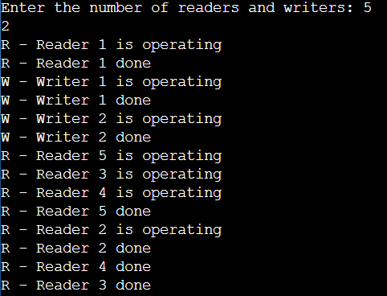

## 2. Write a C program for first readers-writers problem using semaphores.

```c
#include <stdio.h>
#include <unistd.h>
#include <semaphore.h>
#include <pthread.h>

sem_t db, mutex;
int readcount = 0;

void *writer(void *a) {
    int arg = (int)(intptr_t)a;
    sem_wait(&db);
    printf("W - Writer %d is operating\n", arg);
    printf("W - Writer %d done\n", arg);
    sem_post(&db);
}

void *reader(void *a) {
    int arg = (int)(intptr_t)a;
    sem_wait(&mutex);
    readcount++;
    if (readcount == 1)
        sem_wait(&db);
    sem_post(&mutex);
    printf("R - Reader %d is operating\n", arg);
    sem_wait(&mutex);
    readcount--;
    if (readcount == 0)
        sem_post(&db);
    printf("R - Reader %d done\n", arg);
    sem_post(&mutex);
}

int main() {
    int r, w;
    printf("Enter the number of readers and writers: ");
    scanf("%d %d", &r, &w);
    pthread_t readers[r], writers[w];
    sem_init(&mutex, 0, 1);
    sem_init(&db, 0, 1);
    int i = 0;
    while (i < r || i < w) {
        if (i < r)
            pthread_create(&readers[i], NULL, reader, (void *)(intptr_t)(i + 1));
        if (i < w)
            pthread_create(&writers[i], NULL, writer, (void *)(intptr_t)(i + 1));
        i++;
    }
    i = 0;
    while (i < r || i < w) {
        if (i < r)
            pthread_join(readers[i], NULL);
        if (i < w)
            pthread_join(writers[i], NULL);
        i++;
    }
    sem_destroy(&mutex);
    sem_destroy(&db);
    return 0;
}

```
## Output


### Readers-Writers Problem

The Readers-Writers problem models a situation where multiple readers and writers access a shared resource, such as a database. The challenge is to ensure data integrity while allowing multiple readers to access the resource simultaneously or granting exclusive access to a single writer at a time.

### Synchronization Elements

- `sem_t db`: This semaphore controls access to the shared database, allowing only one writer to write at a time. It also enforces mutual exclusion between readers and writers.

- `sem_t mutex`: A mutex semaphore protects the `readcount` variable, ensuring exclusive access when readers modify the count.

- `int readcount`: This variable keeps track of the number of readers currently accessing the database. It is protected by the `mutex` semaphore.

### Implementation Overview

#### Writer
- The `writer` function represents a writer thread.
- It waits on the `db` semaphore, ensuring exclusive access to the database.
- Once granted access, the writer performs its writing operation and then releases the `db` semaphore, allowing other writers or readers to access the database.

#### Reader
- The `reader` function represents a reader thread.
- It first acquires the `mutex` semaphore to update the `readcount` variable.
- If it's the first reader (`readcount == 1`), it also waits on the `db` semaphore to ensure exclusive access when writers are not active.
- After updating the `readcount`, it releases the `mutex` semaphore, allowing other readers to increment it.
- The reader performs its reading operation on the shared resource and updates the `readcount` again before releasing the `mutex` semaphore.
- If the reader is the last to leave, it signals that it has finished reading, releasing the `db` semaphore.

#### Main Function
- In the `main` function, the user is prompted to enter the number of readers and writers.
- Threads for readers and writers are created and run concurrently.
- The code ensures that readers and writers are created and joined correctly.
- Finally, semaphores are destroyed to release resources.

### Usage
- Compile the code using a C compiler.
- Run the executable.
- Enter the number of readers and writers as prompted.
- The program will demonstrate the Readers-Writers problem solution, allowing multiple readers or one writer to access the shared resource at any given time.

This code provides a practical solution to the Readers-Writers problem using pthreads and semaphores to manage concurrent access to a shared resource while maintaining data integrity. It can serve as a valuable example for synchronization in multi-threaded programs.